---
lab:
    title: 'Mod04 - Lab A - Using the Azure Portal and SQL Server Management Studio'
    module: 'The Role of the Azure Database Administrator'
---


# Lab 1 - Using the Azure Portal and SQL Server Management Studio

**Estimated Time: 30 minutes**

**Pre-requisites: None** 

**Lab files: None**

 

# Lab Overview 

Students will explore the Azure Portal and use it to create an Azure VM with SQL Server 2019 installed. Then they will connect to the virtual machine through Remote Desktop Protocol and restore a database using SQL Server Management Studio. 

# Lab Goal

The student will be able to interact with the Azure portal to create a SQL Server Virtual Machine. They should then be able to connect to the virtual machine and use SQL Server Management Studio to restore a database. 

# Lab Objectives

The students will:

- Interact with the Azure portal

- Create a SQL Server Virtual Machine

- Use SQL Server Management Studio to restore a database

# Scenario

You are a database administrator for AdventureWorks. You need to create a test environment for use in a proof of concept. The proof of concept will use SQL Server on an Azure Virtual Machine and a backup of the AdventureWorksDW database. You need to set up the Virtual Machine, restore the database, and query it to ensure it is available. 

# Exercise 1: Provision a SQL Server on an Azure Virtual Machine

**Estimated Time: 20 minutes**

The main tasks for this exercise are as follows: 

1. Explore the Azure Portal and locate important functionality.

2. Create a SQL Server on an Azure Virtual Machine using the Azure Portal.

 

## Task 1: Explore the Azure Portal

1. From the lab virtual machine, if you are not already in the portal, start a browser session and navigate to [https://portal.azure.com](https://portal.azure.com/). 

	

 

2. In the Azure Portal, type subscription in the search bar at the top of the screen. Click on the subscriptions icon. (You may need to log in first.)

	

 

3. On the Subscriptions blade, you will have one or more subscriptions. Review your Subscription name, subscription ID, and your role. 

	

4. Launch the left navigation pane by clicking the horizontal lines next to Microsoft Azure in the top left of the portal. Then select All resources. 

	

	

 

5. The All resources page will list all Azure resources within your selected subscriptions. 

 

6. Select Resource groups in the left navigation.

	

	

	The Resource groups blade will list all Azure resource groups within your selected subscriptions. 


7. On the Resource groups blade, select the Create button. 

	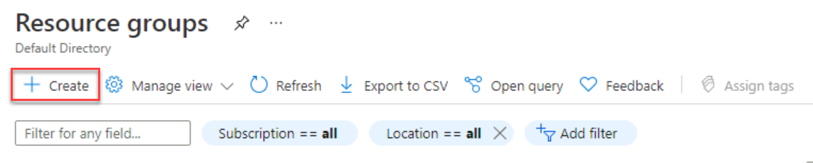

 
8. Ensure you have selected the appropriate subscription for the lab. Name the resource group DP-300-Lab01. Select the nearest Azure region to your location. Select the Review + Create button. Once the review completes, select the Create button. 

	

9. Locate the search bar at the top of the page. Search for Azure SQL. Select the search result for Azure SQL that appears in the results under Services.

	

 

## Task 2: Provision a SQL Server on an Azure Virtual Machine

1. On the Azure SQL blade, select the Create button. 

	


2. On the Select SQL deployment option blade, open the drop-down box under SQL virtual machines. Select the option labeled Free SQL Server License: SQL 2019 Developer on Windows Server 2019. Then select the Create button.
	
	

3. On the Create a virtual machine blade, enter the following information: 

	- Subscription: **&lt;Your subscription&gt;**

	- Resource group: **DP-300-Lab01**

	- Virtual machine name:  **dp300sqlvmlab01**

	- Region: **&lt;your local region, same as the selected region for your resource group&gt;**

	- Availability Options: **No infrastructure redundancy required**
	
	- Image: **Free SQL Server License: SQL 2019 Developer on Windows Server 2019 - Gen1**

	- Azure spot instance: **No**

	- Size: Standard **D2s_v3** (2 vCPUs, 8 GiB memory; you may need to select the "Select size" link to see this option)

	- Administrator account username: **dp300sqlvmlab01admin**

	- Administrator account password: **pwd!DP300lab01** (or your own password that meets the criteria)

	- Selected inbound ports: **RDP (3389)**

	- Would you like to use an existing Windows Server license?: **No**

 

	Make note of the username and password for later use.

	


4. Navigate to the Disks tab and review the configuration. 

	

 
5. Navigate to the Networking tab and review the configuration. 

	
 

6. Navigate to the Management tab and review the configuration. 

	

	Make sure that **Boot diagnostics** has the button for **Enable with managed storage account (recommended)** selected. 
	Verify that **Enable auto_shutdown** is off. 


7. Navigate to the Advanced tab and review the configuration. 

	


8. Navigate to the SQL Server settings tab and review the configuration. 

	

 

	Note—you can also configure the storage for your SQL Server VM on this screen. By default, the SQL Server Azure VM templates create one premium disk with read caching for data, one premium disk without caching for transaction log, and uses the local SSD (D:\ on Windows) for tempdb.


9. Select the Review + create button. Then select the Create button.  
‎
    


10. On the deployment blade, wait until the deployment is complete. The VM will take approximate 5-10 minutes to deploy. Then select the Go to resource button. 

	

 
11. On the overview page for the virtual machine, scroll through the menu options for the resource to review what is available.

	


# Exercise 2: Connect to SQL Server and Restore a Backup

**Estimated Time: 10 minutes**

The main tasks for this exercise are as follows: 

1. Create an RDP (Remote Desktop Protocol) connection to SQL Server on an Azure Virtual Machine

2. Download a database backup file.

3. Restore the database in SQL Server using SQL Server Management Studio

4. Query the database to confirm its availability

 
## Task 1: Connect to the Virtual Machine and download the backup file

1. On the Overview page for the virtual machine, select the Connect button and choose RDP. 

	

 
2. On the RDP tab, select the Download RDP File button. 

	

3. Open the RDP file that was just downloaded. When a dialog appears asking if you want to connect, select the Connect button.   
‎	

 
4. In the Windows Security dialog if you receive the PIN dialog, select More choices. Then choose Use a different account. If you don’t receive the PIN dialog, you can proceed to Step 5.

	

 
5. Enter the username and password selected during the virtual machine provisioning process. Then select the OK button.

	

 
6. When the Remote Desktop Connection dialog appears asking if you want to connect, select the Yes button. 

	


7. A Remote Desktop window will open. On the right, select the No button to indicate you do not want the computer to be discoverable by other devices on the network. Close the small Server Manager popup dialog by clicking the X in the top right of the box. Keep the big Server Manager Window open.

	

 
8. In the Server Manager window, select Local Server on the left and then select On next to IE Enhanced Security Configuration. 

	

 
9. When the Internet Explorer Enhanced Security Configuration dialog appears, set Administrators to Off. Then select the OK button.

	

 
10. Open Internet Explorer by selecting the icon from the task bar. 

	


11. In Internet Explorer, navigate to the following URL: 

	[https://github.com/Microsoft/sql-server-samples/releases/download/adventureworks/AdventureWorksDW2017.bak](https://github.com/Microsoft/sql-server-samples/releases/download/adventureworks/AdventureWorksDW2017.bak)

	

	A dialog will appear asking if you would like to run or save the file.   
	‎

 

12. In the dialog, select the dropdown next to Save and choose Save As. 

	

 

13. In the Save As dialog, navigate to the following folder location:   
‎C:\Program Files\Microsoft SQL Server\MSSQL15.MSSQLSERVER\MSSQL\Backup.  
‎ Leave the file name as AdventureWorksDW2017 and the type as BAK file. Select the Save button. 

    
 
## Task 2: Restore the Database and Verify its Availability

 

1. Select the Windows Start button and type SSMS. Select Microsoft SQL Server Management Studio 18 from the list.  
‎
	


2. When Management Studio opens, the Connect to Server dialog will be pre-populated to the local machine. Select the Connect button. 


	

 

3. In the Object Explorer, right-click on the Databases node and choose Restore Database…

	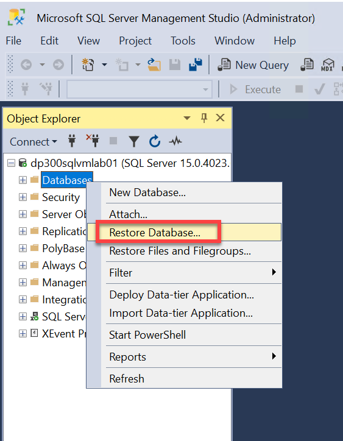

 

4. In the Restore Database dialog, Select Device under Source, and select the button to the right of device labeled with an ellipsis. 

	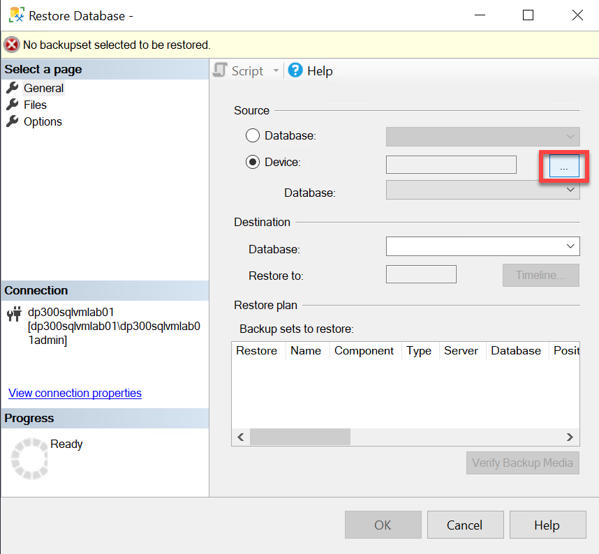

 

5. In the Select backup devices dialog, select Add. 

	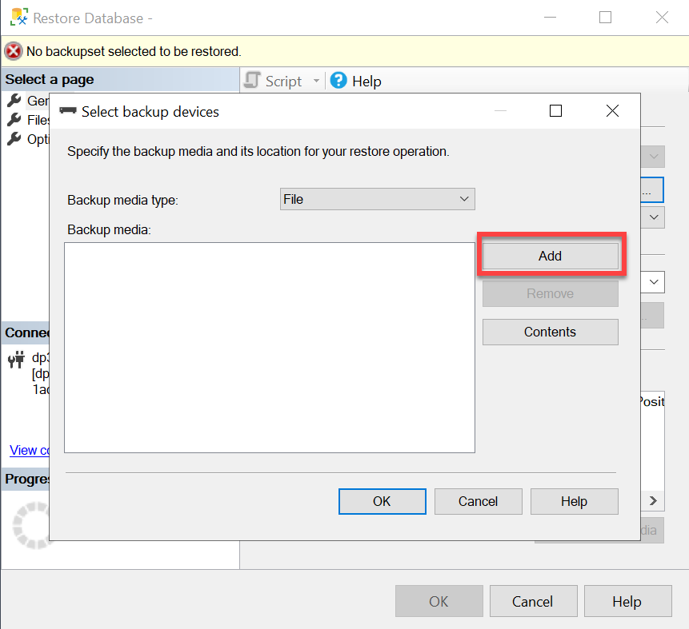


6. In the Local Backup File dialog, select AdventureWorksDW2017.bak and select the OK button. 

	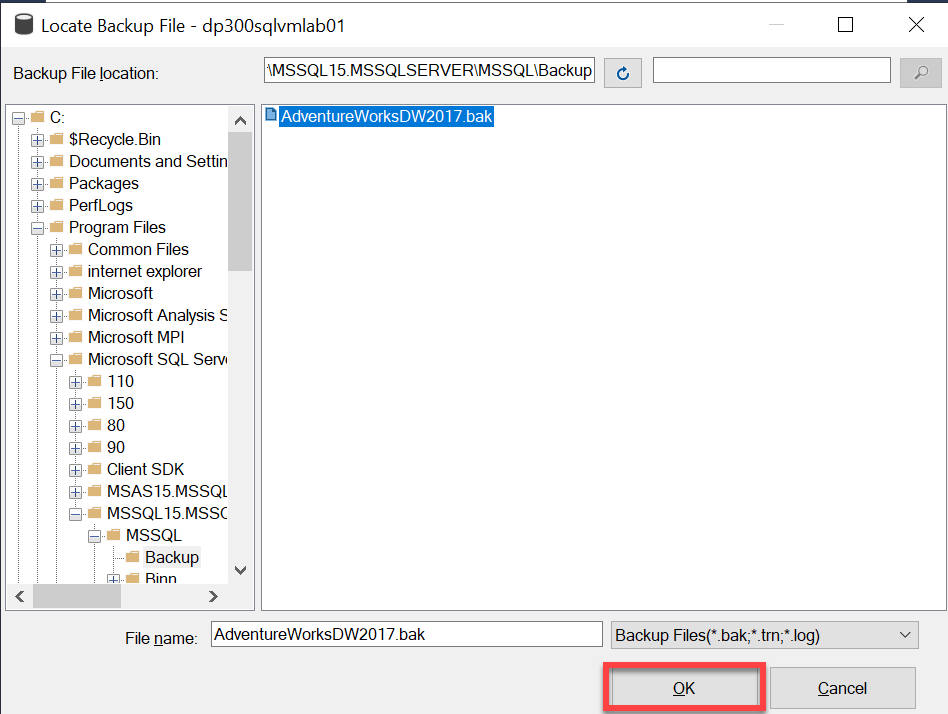

 
7. Verify that there is now one item listed under Backup media in the Select backup devices dialog. Then select the OK button.

	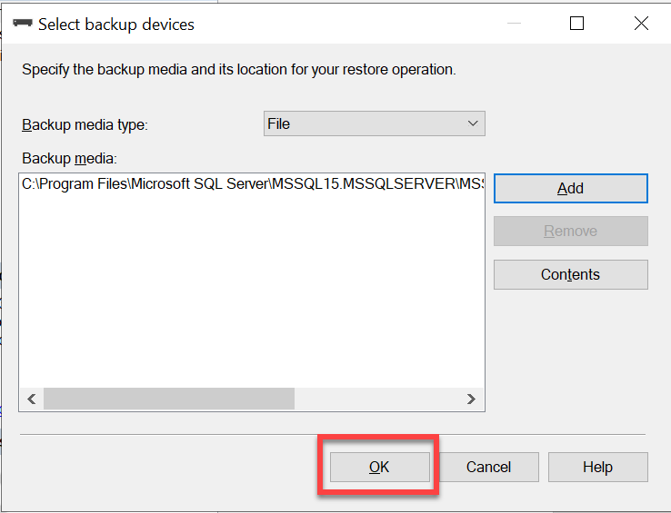


8. Verify that there is one item listed under Backup sets to restore in the Restore Database dialog. Then select the OK button. 

	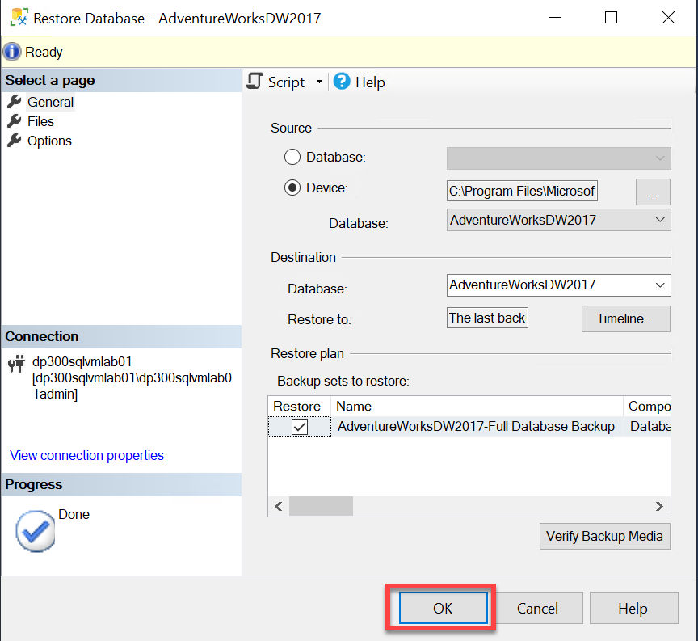

 
9. Once the database restore completes, a dialog box will appear with the message "Database 'AdventureWorksDW2017' restored successfully". Select the OK button.

	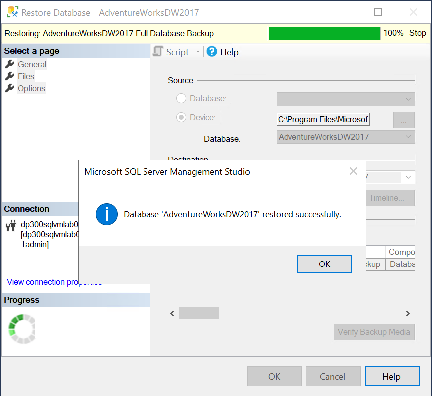

 

10. In the Object Explorer, expand the Databases node, then expand the AdventureWorksDW2017 node, then expand the Tables node. Verify that the database contains several tables including dbo.DimAccount.

	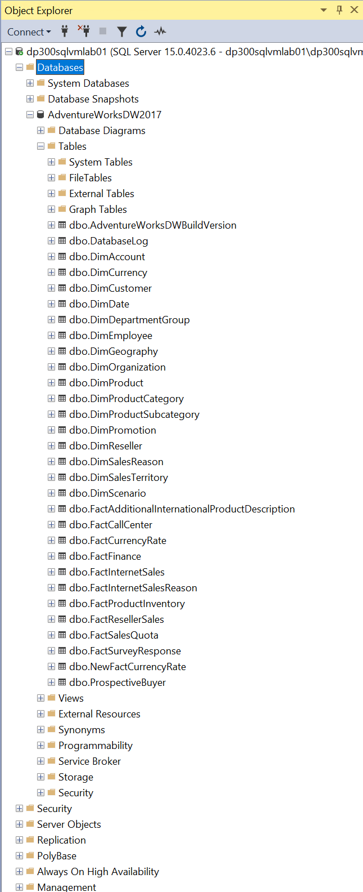

 
11. In Management Studio, select the AdventureWorksDW2017 node in the Object Explorer. Then select the New Query button. 

	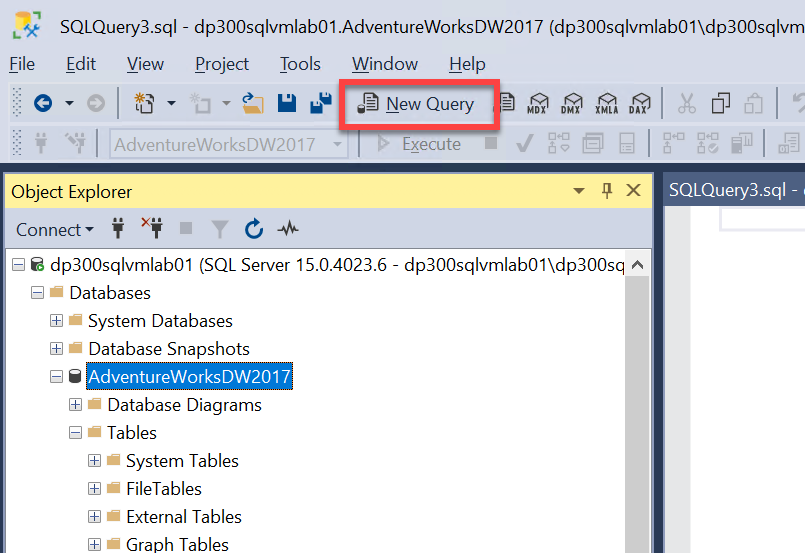


12. Copy and paste the following statement into the new query window: 

	```SQL
	SELECT CalendarYear, Sum(SalesAmount) SalesAmount 

	FROM dbo.FactInternetSales FS

	INNER JOIN dbo.DimDate DD ON FS.OrderDateKey = DD.DateKey

	GROUP BY CalendarYear
	```

	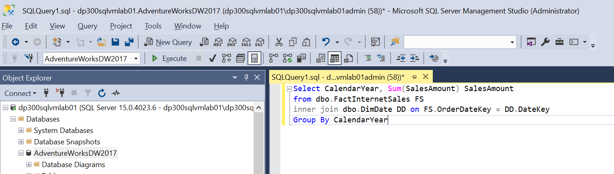


13. Select the Execute button execute the query. Verify that the sales amount for 2010 is **43421.0364**. 

	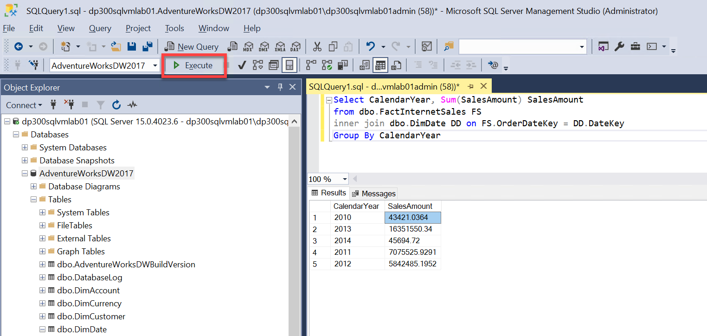

 

 

## Task 3: Clean Up

1. Exit out of the Remote Desktop. 

2. Delete the VM you created in this lab to save costs. You will not be using it for subsequent labs. 

3. Navigate to the main (Overview) blade for the **dp300sqlvmlab01** Virtual Machine and click the delete button in the menu. 

    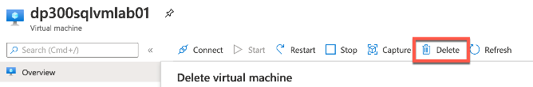
 
4. Click **OK**.
