---
lab:
    title: 'Lab 04 - Lab C – Planning and Implementing a High Availability and Disaster Recovery Environment'
    module: 'Planning and Implementing a High Availability and Disaster Recovery Environment'
---

# Lab 7 – Planning and Implementing a High Availability and Disaster Recovery Environment

**Estimated Time**: 90 minutes

**Pre-requisites**: The Azure SQL Database used by Exercise 1 was created in the lab for Module 3. 

**Lab files**: The files for this lab are located in the D:\Labfiles\High Availability folder.

# Lab overview

The students will execute two main tasks: make Azure SQL Database geo-redundant, and backup to and restore from a URL which uses Azure. 

# Lab objectives

After completing this lab, you will be able to:

- Enable geo-replication for Azure SQL Database

- Backup and restore a SQL Server database using a URL


# Scenario

Now that you have automated day-to-day tasks in the previous lab, as the Senior Data Engineer, you are tasked with improving the availability of both IaaS and PaaS configurations for your database environment. You are tasked with the following objectives:

- Enable geo-replication for Azure SQL Database to increase availability for a database.

- Back up a database to a URL in Azure and restore it after a human error has occurred.


# Exercise 1: Enable Geo-Replication for Azure SQL Database

Estimated Time: 45 minutes

Overview

The Students will alter the configuration of the Azure SQL Database created during the lab for Module 3 to make it highly available.

Scenario

As a DBA within WideWorldImporters you need to know how to enable geo-replication for Azure SQL Database, ensure it is working, and know how to manually fail it over to another region using the portal.

Pre-requisites

- Azure account created for the student – must provide a login (e-mail) and password

- Azure SQL Database server and database pre-created

 

1. If you are not logged into the Azure portal via a browser window, do so using the Azure credentials provided to you.

2. From the menu, select SQL databases as shown below.

	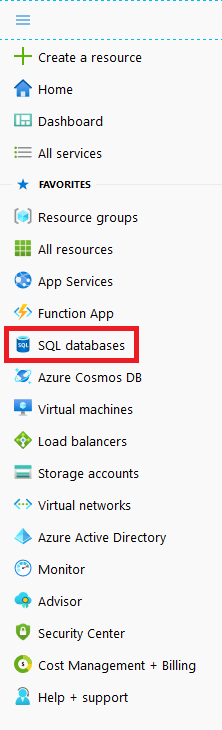

3. Click on the Azure SQL Database that was created in Lab 3. An example is shown below.

	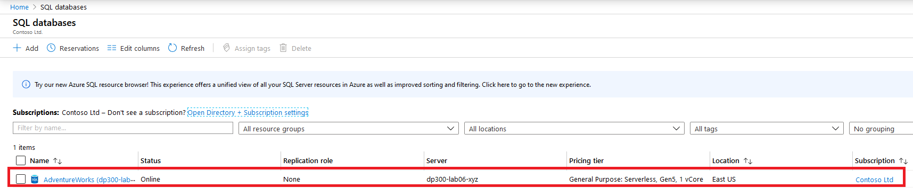

 

4. In the blade for the database, under Data management, select Replicas. 

	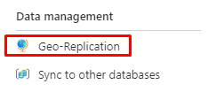

	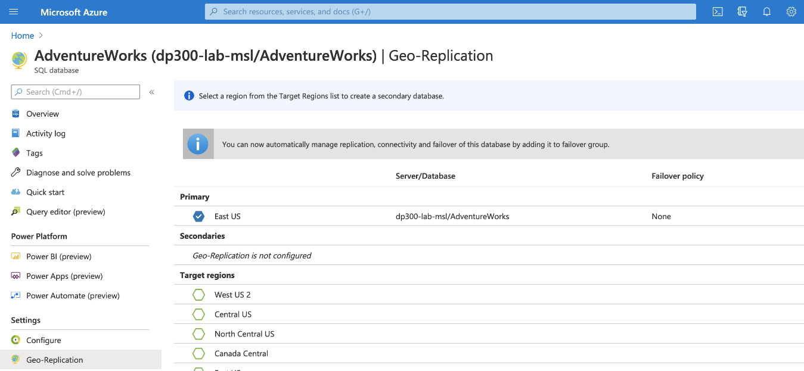

5. Click on Create replica button on the top left side. 

	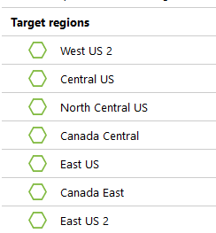

6. Under **Server**, select **Create New**. On the new server pane, enter a unique server name, a valid admin login, and a secure password, and select the region you chose as the target region and then click **OK** to create the server.

7. Back in the Geo-Replica blade, click **Review + Create**, and then click **Create**. The secondary server and the database will now be created. To check the status, look under the bell icon at the top of the portal. If successful, it will progress from Deployment in progress to Deployment succeeded.

	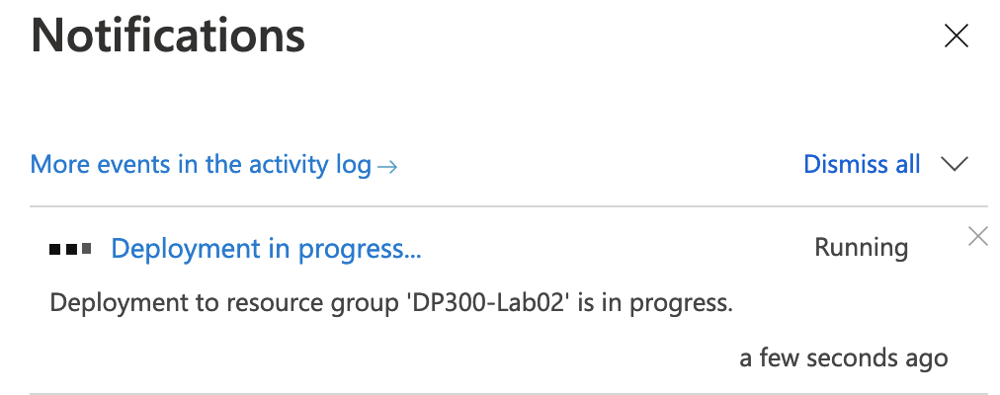

8. When deployment has completed, use the **Go to Resource** to view the secondary geo-replica of the database and in the **database Features** section at the bottom of the **Overview** page, note that the **Geo-Replicas** setting indicates that this database is the **Secondary**.

	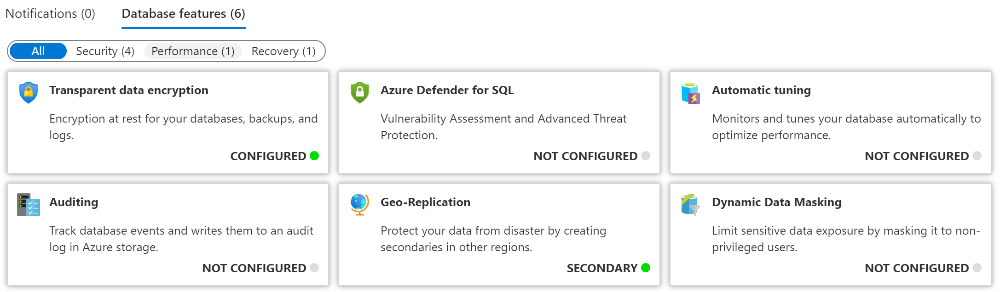

9. Now that the Azure SQL Database is configured with replicas, you will perform a failover. Select the **Geo-Replica** page for the secondary server and note that the primary and secondary servers are indicated.

10. Select the **...** menu for the secondary server and click **Forced Failover**.

	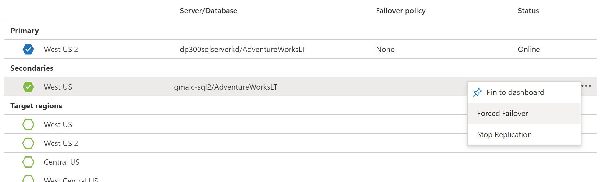

11. When prompted, click **Yes**. 

	The status of the primary replica will switch to Pending and the secondary, Failover. The process will take a few minutes. When complete, the roles will switch with the secondary becoming the new primary and the old primary becoming the secondary.

# Exercise 2: Backup to URL and Restore from URL

Estimated Time: 45 minutes

The tasks for this exercise are as follows:

- Configure backup to URL

- Back up WideWorldImporters

- Restore WideWorldImporters

## Task 1: Configure Backup to URL

Before backing up a database in SQL Server to Azure, there are some configuration tasks to perform. 

**Note:** There are several long strings, including storage account keys and shared access signatures, that are generated and then reused. You should consider opening up a Notepad file within the lab VM to use for holding these strings. 

1. Verify that your context is the LON-SQL1 Virtual Machine.

2. Start Edge and log into the Azure portal ([https://portal.azure.com](https://portal.azure.com/)) unless you are are already there.

3. Open a Cloud Shell prompt by selecting the icon shown below in the upper right corner.

	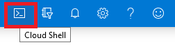

4. At the bottom half of the portal, you may see a message welcoming you to Azure Cloud Shell, if you have not yet used Cloud Shell. Select Bash.

	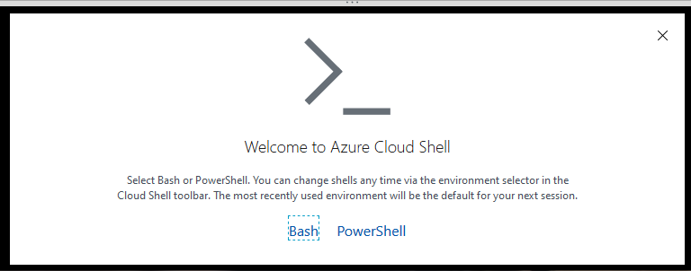

5. If you have not previously used Cloud Shell, you must give it storage. Click Create Storage in the dialog below.

	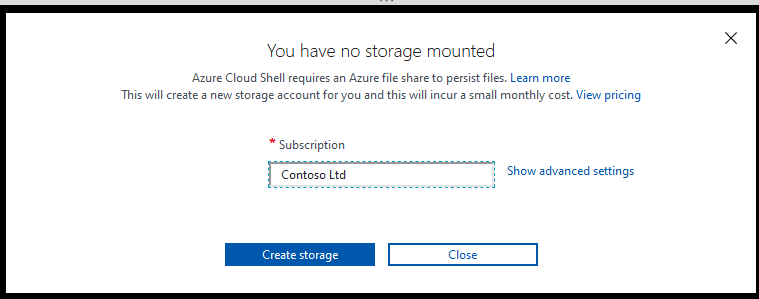


6. If you have already used Cloud Shell, just make sure the upper left corner of the Cloud shell screen shows Bash. You can use the drop down arrow to select either PowerShell or Bash. 
 

	Once complete, you will see a prompt similar to the one below.

	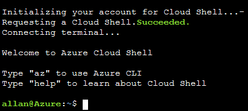


7. Create a storage account from the CLI using by copying the following command into cloud shell.

	```
	az storage account create -n dp300storage -g DP-300-Lab02 --kind StorageV2 -l eastus2
	```

	Edit the command so that your storage account name is unique and all lower case with no special characters. You should change *dp300storage* in the above to a unique name like *dp300storagemsl123*. The value *DP-300-Lab02* is the name of an existing Resource Group. Make sure you use one that has been created in an earlier lab. Change the region if desired. Press Enter to run the command. 


	Next you will get the account keys for your account, which you will use in subsequent steps. Execute the following code in cloud shell, after editing to use the same name (after the -n) and resource group (after the -g) that you used in the previous command.

	```
	az storage account keys list -g DP-300-Lab02 -n dp300storage
	```

	Your account key will be in the results of the above command. Make sure you  Copy the returned value for key1 (without the double quotes) as shown here. You might save it in Notepad. 


	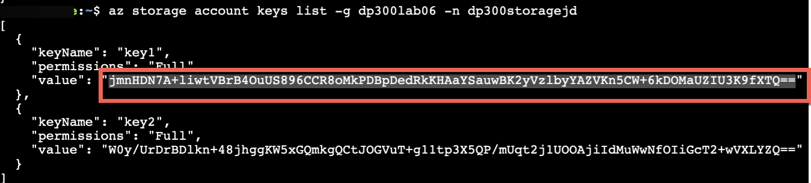
 

8. Backing up a database in SQL Server to a URL uses a storage account and a container within it. You will create a container specifically for backup storage in this step. To do this, execute the following command where *dp300storage* is the storage account name used when creating the storage account and *storage_key* is the key generated above.

	```
	az storage container create --name "backups" --account-name "dp300storage" --account-key "storage_key" --fail-on-exist
	```
 
	The output should return true.

	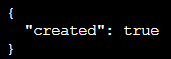


9. To further verify the container backups has been created, execute the following, where *dp300storage* is the storage account name used you created and *storage_key* is the key you generated above. 

	```
	az storage container list --account-name "dp300storage" --account-key "storage_key"
	```

	Part of the output should return something similar to below.

	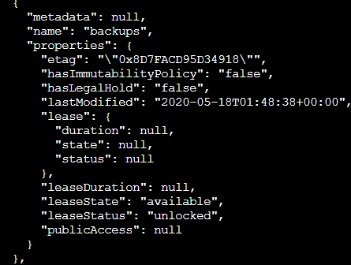


10. A shared access signature (SAS) at the container level is required for security. This can be generated via Cloud Shell or PowerShell. Execute the following, where *dp300storage* is the storage account name you created above, *storage_key* is the key generated above, and *date_in_the_future* is a time later than now. date_in_the_future must be in UTC. An example is 2020-10-31T00:00Z which translates to expiring at October 31, 2020 at midnight:

	```
	az storage container generate-sas -n "backups" --account-name "dp300storage" --account-key "storage_key" --permissions "rwdl" --expiry "date_in_the_future" -o tsv
	```
	**Note: The format for expiry is "YYYY-MM-DD", where YYYY is the four digit year, MM is the two digit Month, and DD is the two digit day.**

	The output should return something similar to the value shown below which will be used in the next Task. You can copy and save the value in Notepad along with the key you saved earlier. 

	


## Task 2: Back Up WideWorldImporters

Now that the functionality is configured, you can generate a backup file as a blob in Azure. 

1. Open SQL Server Management Studio and ensure you are connected to LON-SQL1.

2. Click New Query.

3. Create the credential that will be used to access storage in the cloud with the following Transact-SQL. (If a credential already exists, drop it first.) Fill in the appropriate values, where *dp300storage* is the storage account name created in Task 1, Step 8 and *sas_token* is the value generated in Task 1, Step 10 (starting with *se=...*). 

	```sql
	IF EXISTS 

	(SELECT * FROM sys.credentials 

	WHERE name = 'https://dp300storage.blob.core.windows.net/backups') 

	BEGIN
	
	    DROP CREDENTIAL [https://dp300storage.blob.core.windows.net/backups]
	    
	END
	
	GO


	CREATE CREDENTIAL [https://dp300storage.blob.core.windows.net/backups]

	WITH IDENTITY = 'SHARED ACCESS SIGNATURE',

	SECRET = 'sas_token'

	GO 
	```
	

4. Click **Execute**. This should be successful.

5. Back up the database WideWorldImporters to Azure with the following command in Transact-SQL, where *dp300storage* is the storage account name used in Task 1:

	```sql
	BACKUP DATABASE WideWorldImporters 

	TO URL = 'https://dp300storage.blob.core.windows.net/backups/WideWorldImporters.bak';

	GO 
	```

	This may take some time. If successful, you should see output similar to this:

	Processed 1240 pages for database 'WideWorldImporters', file 'WWI_Primary' on file 1.

	Processed 53104 pages for database 'WideWorldImporters', file 'WWI_UserData' on file 1.

	Processed 3865 pages for database 'WideWorldImporters', file 'WWI_InMemory_Data_1' on file 1.

	Processed 1468 pages for database 'WideWorldImporters', file 'WWI_Log' on file 1.

	BACKUP DATABASE successfully processed 59677 pages in 14.839 seconds (31.419 MB/sec).

	Completion time: 2020-05-18T08:01:41.6935863+00:00

	

	If something is configured wrong, you will see an error message similar to the following:

	Msg 3201, Level 16, State 1, Line 33  
	‎Cannot open backup device 'https://dp300storage.blob.core.windows.net/container_name/WideWorldImporters.bak'. Operating system error 50(The request is not supported.).  
	‎Msg 3013, Level 16, State 1, Line 33  
	‎BACKUP DATABASE is terminating abnormally.


	Check that you did not mistype anything and that everything was created successfully.

6. To see that the file is actually in Azure, you can use Storage Explorer or Azure Cloud Shell. The syntax in Bash is as follows, where *dp300storage* is the storage account name used in Task 1, and *account_key* is the key used there as well. 
	```
	az storage blob list -c "backups" --account-name "dp300storage" --account-key "storage_key"
	```
	
	Sample output is shown below.

	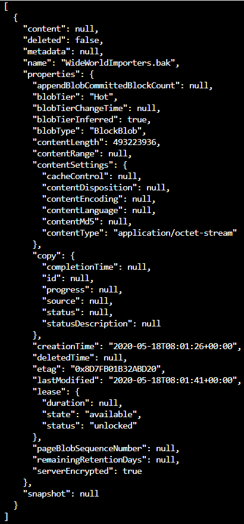

 
## Task 3: Restore WideWorldImporters

This task will show you how to restore a database.


1. In SQL Server Management Studio, in a New Query window, execute 
	```sql
	USE WideWorldImporters;
	GO
	
	```

2. Now execute the statement below to return the very first row of the Customers table which has a CustomerID of 1. Note the name of the customer.
	```sql
	SELECT TOP 1 * FROM Sales.Customers;
	GO
	
	```
	
3. Run this command to change the name of that customer.
	```sql
	UPDATE Sales.Customers
	SET CustomerName = 'This is a human error'
	WHERE CustomerID = 1;
	GO
	
	```

4. Re-run Step 2 to verify that the name has been changed. Now imagine if someone had changed thousands or millions of rows without a WHERE clause – or the wrong WHERE clause.

5. To restore the database to get it back to where it was before the change you made in Step 3, close any queries that are currently connected to the **WideWorldImporters** database, and then execute the following, where *dp300storage* is the storage account name used in Task 1.

	```sql
	USE master;
	GO

	RESTORE DATABASE WideWorldImporters 
	FROM URL = 'https://dp300storage.blob.core.windows.net/backups/WideWorldImporters.bak';
	GO
	```

	This may take some time. The output should be similar to this:

	Processed 1240 pages for database 'WideWorldImporters', file 'WWI_Primary' on file 1.

	Processed 53104 pages for database 'WideWorldImporters', file 'WWI_UserData' on file 1.

	Processed 1468 pages for database 'WideWorldImporters', file 'WWI_Log' on file 1.

	Processed 3865 pages for database 'WideWorldImporters', file 'WWI_InMemory_Data_1' on file 1.

	RESTORE DATABASE successfully processed 59677 pages in 16.167 seconds (28.838 MB/sec).

	Completion time: 2020-05-18T08:35:06.6344123+00:00

6. When the restore of WideWorldImporters is finished, re-run Steps 1 and 2. The data will be back to what it was.
